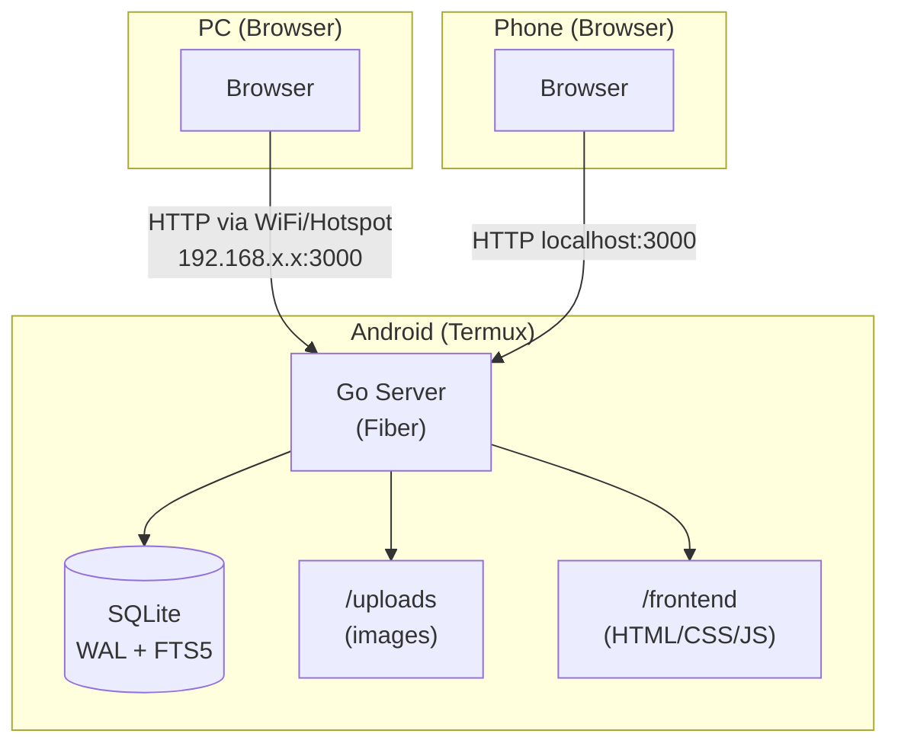
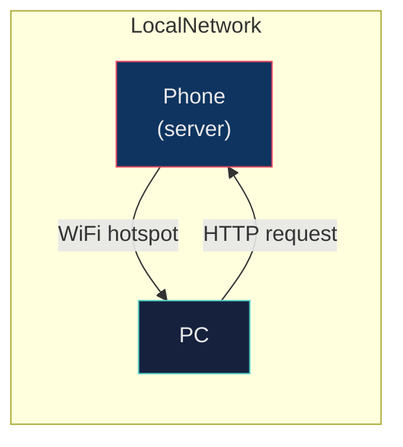

# Architecture - Mermaid

```mermaid
graph TB
    subgraph Android["Android (Termux)"]
        Server["Go Server<br/>(Fiber)"]
        DB[("SQLite<br/>WAL + FTS5")]
        Uploads["/uploads<br/>(images)"]
        Static["/frontend<br/>(HTML/CSS/JS)"]
    end

    subgraph PC["PC (Browser)"]
        BrowserPC["Browser"]
    end

    subgraph Phone["Phone (Browser)"]
        BrowserPhone["Browser"]
    end

    BrowserPC -->|"HTTP via WiFi/Hotspot<br/>192.168.x.x:3000"| Server
    BrowserPhone -->|"HTTP localhost:3000"| Server

    Server --> DB
    Server --> Uploads
    Server --> Static
```

## Network flow

```mermaid
graph LR
    subgraph LocalNetwork
        PhoneSrv["Phone<br/>(server)"]
        PCClient["PC"]
    end

    PhoneSrv -->|WiFi hotspot| PCClient
    PCClient -->|HTTP request| PhoneSrv

    style PhoneSrv fill:#0f3460,stroke:#e94560,color:#eaeaea
    style PCClient fill:#16213e,stroke:#4ecdc4,color:#eaeaea
```