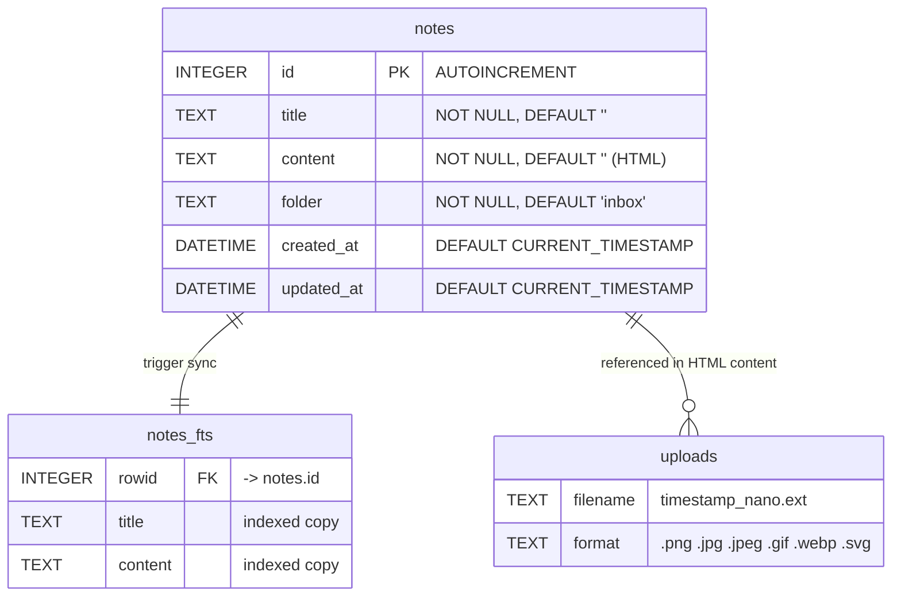
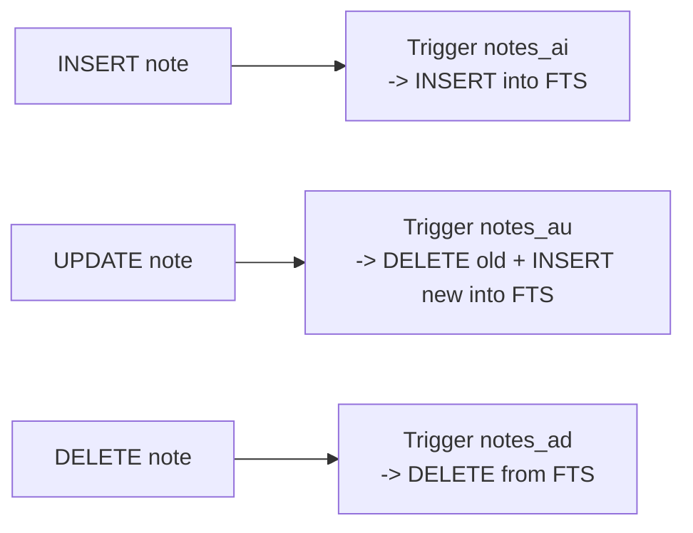

# Data model - Mermaid

## Allowed values for folder

| Value | Description |
|-------|-------------|
| `inbox` | Unsorted notes |
| `concepts` | Core knowledge |
| `practices` | Learned best practices |
| `ui-ux` | UI/UX captures and analysis |
| `postmortems` | Errors and lessons learned |
| `references` | Links, resources, tools |

## FTS5 triggers

