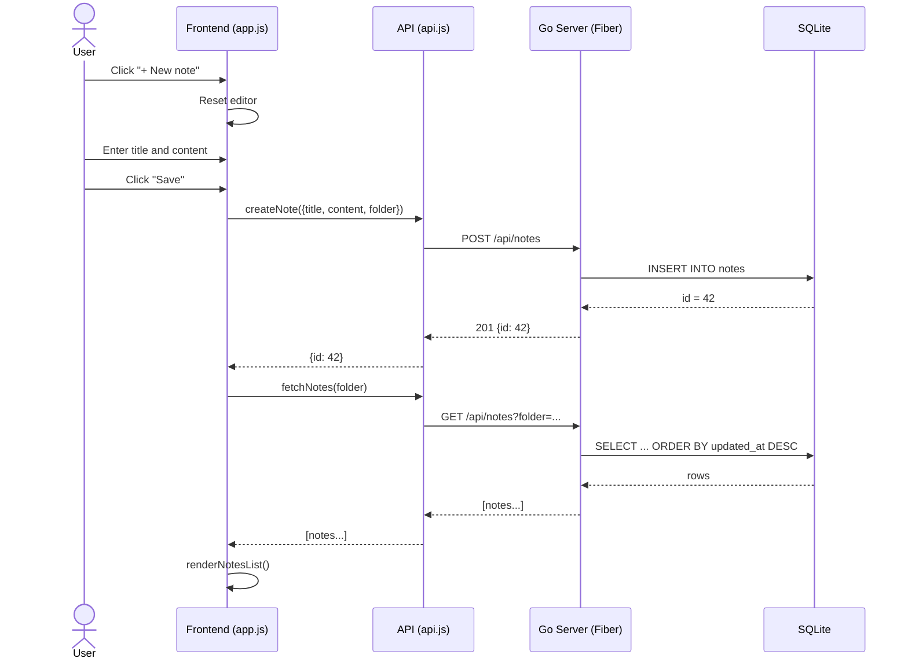
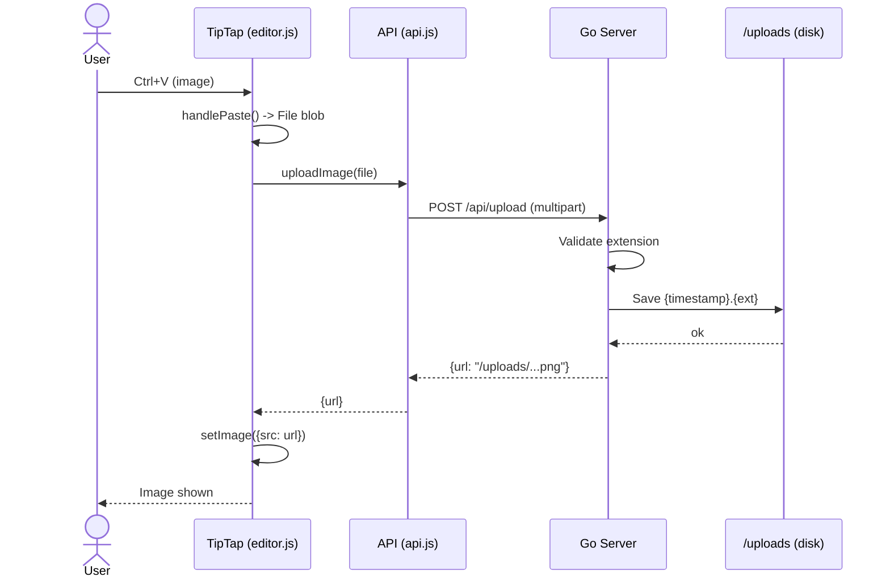
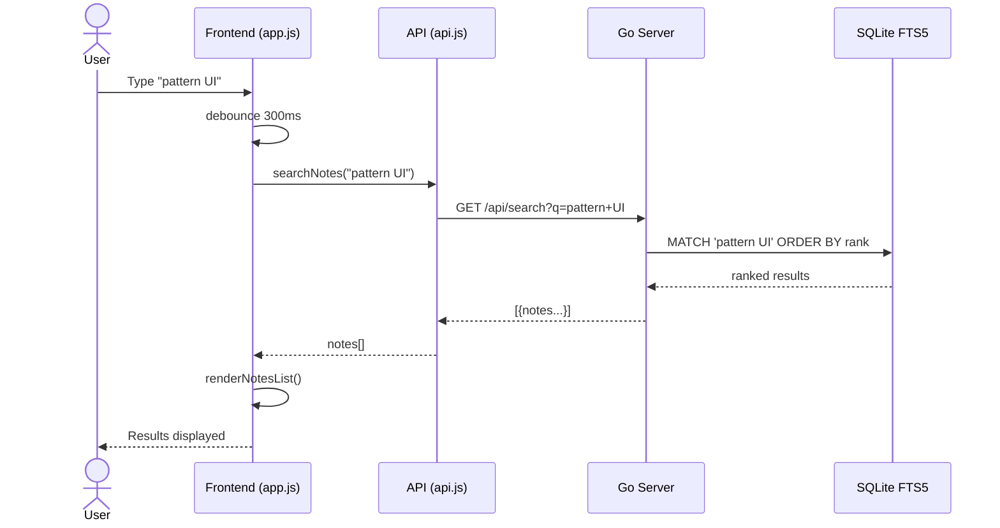

# Sequences - Mermaid

## Create a note

```mermaid
sequenceDiagram
    actor U as User
    participant F as Frontend (app.js)
    participant A as API (api.js)
    participant S as Go Server (Fiber)
    participant DB as SQLite

    U->>F: Click "+ New note"
    F->>F: Reset editor
    U->>F: Enter title and content
    U->>F: Click "Save"
    F->>A: createNote({title, content, folder})
    A->>S: POST /api/notes
    S->>DB: INSERT INTO notes
    DB-->>S: id = 42
    S-->>A: 201 {id: 42}
    A-->>F: {id: 42}
    F->>A: fetchNotes(folder)
    A->>S: GET /api/notes?folder=...
    S->>DB: SELECT ... ORDER BY updated_at DESC
    DB-->>S: rows
    S-->>A: [notes...]
    A-->>F: [notes...]
    F->>F: renderNotesList()
```

## Image upload (Ctrl+V)

```mermaid
sequenceDiagram
    actor U as User
    participant E as TipTap (editor.js)
    participant A as API (api.js)
    participant S as Go Server
    participant FS as /uploads (disk)

    U->>E: Ctrl+V (image)
    E->>E: handlePaste() -> File blob
    E->>A: uploadImage(file)
    A->>S: POST /api/upload (multipart)
    S->>S: Validate extension
    S->>FS: Save {timestamp}.{ext}
    FS-->>S: ok
    S-->>A: {url: "/uploads/...png"}
    A-->>E: {url}
    E->>E: setImage({src: url})
    E-->>U: Image shown
```

## Full-text search

```mermaid
sequenceDiagram
    actor U as User
    participant F as Frontend (app.js)
    participant A as API (api.js)
    participant S as Go Server
    participant FTS as SQLite FTS5

    U->>F: Type "pattern UI"
    F->>F: debounce 300ms
    F->>A: searchNotes("pattern UI")
    A->>S: GET /api/search?q=pattern+UI
    S->>FTS: MATCH 'pattern UI' ORDER BY rank
    FTS-->>S: ranked results
    S-->>A: [{notes...}]
    A-->>F: notes[]
    F->>F: renderNotesList()
    F-->>U: Results displayed
```