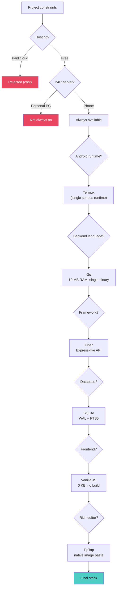
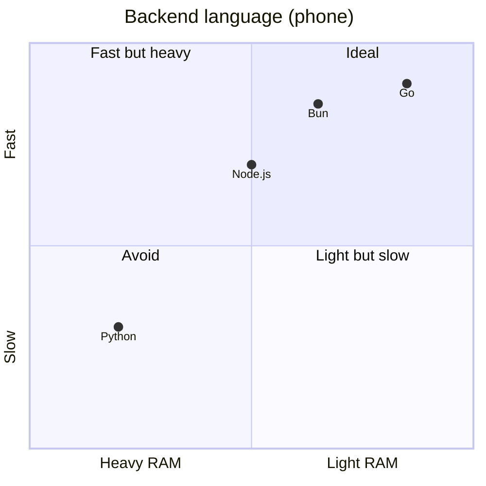
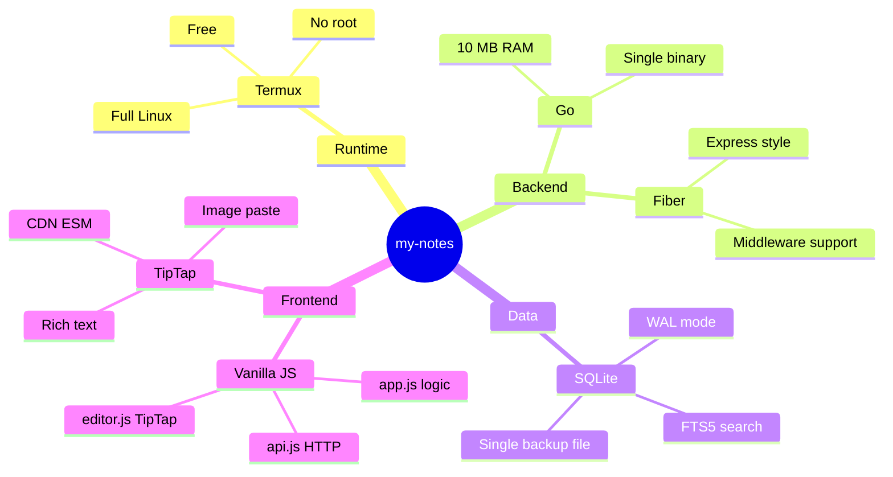

# Stack decision - Mermaid

## Decision tree

## Detailed comparisons

### Backend language

### Frontend framework

| Criteria | React | Vue 3 | Svelte | **Vanilla JS** |
|----------|-------|-------|--------|----------------|
| Bundle weight | 45 KB | 30 KB | 5 KB | **0 KB** |
| Build step | yes | yes | yes | **no** |
| HTML/JS separation | JSX | SFC | SFC | **full** |
| TipTap editor support | yes | yes | yes | **yes** |
| Learning curve | high | medium | low | **none** |

### Rich editor

| Criteria | TipTap | Quill | CKEditor | ProseMirror |
|----------|--------|-------|----------|-------------|
| Image paste | **native** | plugin | yes | low-level setup |
| CDN/ESM | **yes** | yes | partial | partial |
| Extensibility | **high** | medium | high | very high |
| Simple API | **yes** | yes | medium | complex |
| Free | **yes** | yes | freemium | yes |

## Final summary

